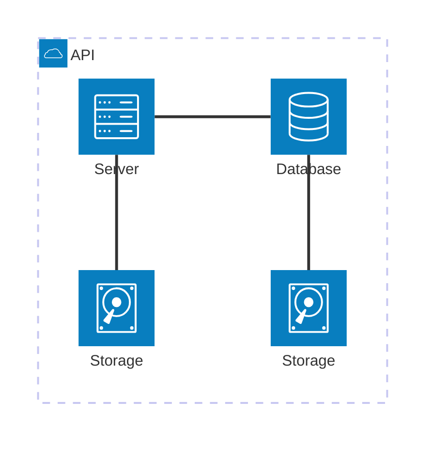
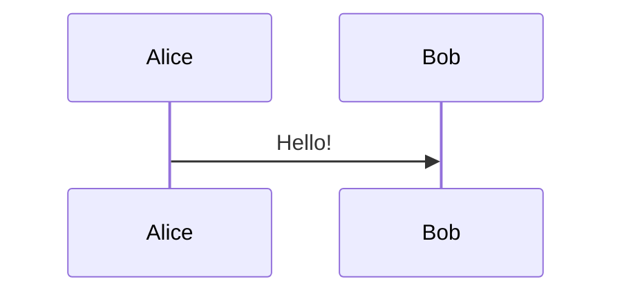
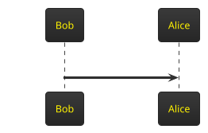
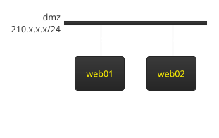

---
# global part
# You can also start simply with 'default'
theme: seriph
title: Slidev - presentations for developers
info: |
  Presentation slides for developers.
  Learn more at [Sli.dev](https://sli.dev)

# https://sli.dev/features/drawing
drawings:
  persist: false
# slide transition: https://sli.dev/guide/animations.html#slide-transitions
transition: slide-left
# enable MDC Syntax: https://sli.dev/features/mdc
mdc: true

addons:
    - slidev-component-progress

# first slide part
background: https://images.unsplash.com/photo-1517245386807-bb43f82c33c4?q=80&w=2070&auto=format&fit=crop&ixlib=rb-4.0.3&ixid=M3wxMjA3fDB8MHxwaG90by1wYWdlfHx8fGVufDB8fHx8fA%3D%3D
# apply "all text in the center" style to the first silde
class: text-center
---

<style> h1 { text-align: center; } </style>

# Presentations for developers

## <logos-slidev /> **Slidev**


---

# Requirements

- markdown as a slides language
- simple way to :
    - present code (syntax highlighting, lines selection, etc.)
    - add tables, lists and other basic entities
    - add 2 columns, images
- VSCode support
- export to pdf, html for github.io, pptx

---

# Frameworks - overview

<br>

### <logos-slidev /> Slidev - if you prefer rich markdown functionality + small amount of html
<br>

###  {style="display: inline;" height="240px"} - if you prefer html or basic markdown + a lot of html

<br>

### lookatme - if you are a geek that prefers to present in terminal

---

# Slidev environment setup

1. install `nodejs`: [nodejs.org](https://nodejs.org)
2. install `Slidev` globally or locally
    - local installation (officially recommended)
    ```cmd
    npm init slidev@latest
    ```
    - global installation (not recommended but more convenient to use)
    ```cmd
    npm i -g  @slidev/cli @slidev/theme-default @slidev/theme-seriph @slidev/types @iconify-json/logos vue slidev-component-progress
    rem set NODE_PATH to force npm use global packages:
    setx NODE_PATH "%APPDATA%\npm\node_modules"
    ```
3. `Slidev` extension for `VSCode`
    - install `Slidev` extension for `VSCode`
    - if  {style="display: inline;" width="30px"} is not visible in `Activity Bar`: in palette menu: `slidev: force enable slidev extension` 
    - run `powershell` as administrator and execute
    ```powershell
    Set-ExecutionPolicy RemoteSigned -Scope CurrentUser
    ```

---

# Global vs Local installation

<style>th {text-align: center;}</style>
| | Global installation | Local installation |
|-|---------------------|--------------------|
| setup | complicated:<br>`npm i -g  @slidev/cli @slidev/types ...`<br>`setx NODE_PATH "%APPDATA%\npm\node_modules"` | simple:<br>`npm init slidev@latest`|
| working<br>directory<br>content | only files you add | 1. slides.md - default presentation<br>2. files related to slides.md<br>3. npm packages<br>4. .gitignore|
| npm libs | `%APPDATA%\npm\node_modules` | your project directory |
| start server | `slidev <YourFile>.md` | `npm run dev` |

---
clicks: 1
---

# Ways to edit your slides

<br>

1. `VSCode` `Slidev` extension
2. Open in a browser (usually http://localhost:3030/) + Embedded editor 
3. `VSCode` + webview (Command Palette: `Simple browser: Show`)
4. Online editor https://sli.dev/new

<br>
<br>
<br>
<br>
<br>

<div style="text-align: center">
  <v-click at="1">live demo</v-click>
</div>

---

# Presentation structure: file structure

<br>

```yaml
--- << slides and metadata separator
# all slides metadata
---

# slide 1 header

---
slide 2 metadata
---

# Slide 2 header
slide content

---

Slide 3

---
```

---

# Presentation structure: all slides metadata

```yaml
---
# global part
# You can also start simply with 'default'
theme: seriph
title: Slidev - presentations for developers
info: Presentation slides for developers.

# slide transition: https://sli.dev/guide/animations.html#slide-transitions
transition: slide-left
# enable MDC Syntax: https://sli.dev/features/mdc
mdc: true

# first slide part
background: https://cover.sli.dev
# apply "all text in the center" style to the first slide
class: text-center
---
```

[Learn more](https://sli.dev/custom/#headmatter)

---
layout: iframe-right
url: https://sli.dev/builtin/layouts
---

# Presentation structure: slide metadata

<br>
set if you want to change defaults 
```yaml
---
# layout https://sli.dev/builtin/layouts
# most useful layouts:
# image-left/image-right/iframe-left/iframe-right
# two-cols-header/two-cols
layout: two-cols-header
# apply "text-center" style to the the next slide
class: text-center
# you can inject slides from other files 
src: ./pages/external_slide.md
# hide the slide in the table of content 
hideInToc: false
---
```

[Learn more](https://sli.dev/custom/#frontmatter)

---
layout: two-cols-header
layoutClass: gap-4 #if you want to add some space b/w columns
hideInToc: true
---

# Layout: two-cols-header

::left::

## Slide metadata:

```yaml
---
layout: two-cols-header
layoutClass: gap-4  #if you want to add some space b/w columns
---

# Slide header

::left::

## Left column header

left column content

::right::

## Right column header

right column content


```

::right::

## Right column header

right column content

---
layout: image-right
image: ./right-image.webp
hideInToc: true
---

# Layout: image-right

## Slide metadata:

```yaml
---
layout: image-right
image: ./right-image.webp
# regular local image does not work after build
# we have to place images in 'public' folder
# image: ./images/right-image.webp <<- not working after build

# see: https://sli.dev/guide/faq#assets-handling
---

# Slide header

left column content

```

---

# Clicks Animations

<div style="text-align: center">
You can add `v-click` to elements to add a click animation
</div>

<v-click>

This shows up when you click the slide: 

```html
<v-click>This shows up when you click the slide.</v-click>
```
</v-click>

<v-click at="2">

show a list. item by item. at="Number" attribute allows to show at specified click.
```html
<v-clicks at="2">

- item 1
- item 2
- item 3
</v-clicks>
```
</v-click>

<v-clicks at="2">

- item 1
- item 2
- item 3
</v-clicks>

<v-click at="5">

[Learn more](https://sli.dev/guide/animations#click-animation)
</v-click>


---

# Code presentation + comments

<br>
<br>

```cpp {all|1|3|4|all}{lines:true}
#include <iostream>

int main() {
    std::cout << "hello world! " << std::endl;
    return 0;
}
```
<br>
<br>

<v-switch at="0">
  <template #1><pre>Slidev has a default code highlighting.
  if you prefer a different one - change it in the file: ./setup/shiki.ts
  syntax:
  ```language {all|1,2-4|3} {lines:true}
  your code
  ```
  </pre>
  </template>
  <template #2> ln 1:<br>a comment about include iostream</template>
  <template #3> ln 2:<br>a comment about main</template>
  <template #4><pre>to show comments use &lt;v-switch&gt; + at="" to synch with the code
  &lt;v-switch at="0"&gt;
    &lt;template #1&gt; message 1&lt;/template&gt;
    &lt;template #1&gt; message 2&lt;/template&gt;
  &lt;/v-switch&gt;
  </pre></template>
  <template #5> More info:<br>
<a href="https://sli.dev/custom/config-highlighter">Configuring code highlighter</a><br>
<a href="https://sli.dev/features/line-highlighting">Line highlighting in the code</a><br>
<a href="https://sli.dev/features/code-block-line-numbers">Line numbers in the code</a><br>
<a href="https://sli.dev/guide/animations.html">Animations in Slidev</a></template>
</v-switch>

---

# Code transformations - Shiki Magic Move

````md magic-move {lines: true}
```cpp
// step 1
int main()
{
  return 0;
}
```

```cpp {1-2,5|*}
#include <iostream>
// step 2
int main()
{
  std::cout << "hello world" << std::endl;
  return 0;
}
```
````


---
layout: two-cols-header
---

# Diagrams: Mermaid

::left::

## class


## sequence diagram
<br>


::right::

## Mermaid supported diagrams:

Pros: 
- good online editing tools
- GitHub support for markdown
- good looking diagrams

Supported graphs:
- standard: Sequence, Class, State
- Pie, XYChart, Git, Flow
- and more

try online (with graphical editor):

{style="display: inline;" width="7%"} [mermaidchart.com/play](https://www.mermaidchart.com/play)

---
layout: two-cols-header
---

# Diagrams: PlantUML

::left::

## Sequence diagram



<br>

## Network


::right::

## PlantUML supported diagrams:

Pros: 
- wide range of supported graphs

Supported graphs:
- standard: Flow, Sequence, Class, State
- Network, Usecase, Object, Activity
- Json, Yaml, EBNF, Regex
- and more

try online:

[🌱 plantuml.com/plantuml/uml](https://www.plantuml.com/plantuml/uml/)<br>
[🌱 plantuml docs](https://plantuml.com/)

---

# Publish presentation to github

<v-clicks>

1. create a github repo. e.g. `slidev-into`
2. build your project into into docs folder:<br>
   slidev build -o DOCS-DIR-PATH YOUR-SLIDES.md --base /REPO-NAME <br>
   example:
   ```cmd
   cd slidev-intro
   slidev build -o docs slidev_for_devs.md --base /slidev-intro
   ```
4. add `docs` folder and push
   ```cmd
   git add docs
   git commit -m "add docs"
   git push
   ```
3. go to https://github.com/YOUR-NAME/REPO-NAME/settings/pages<br>
   select `master` branch, add `/docs` and click `Save`
4. result: https://YOUR-NAME.github.io/REPO-NAME<br>
   example: https://alex-176.github.io/slidev-intro

</v-clicks>

---

# Tips and tricks: headers, inline images, logos

<br>

if a theme has left-aligned headers and you want center-aligned ones - set style for h1:
  ```html
  <style> h1 { text-align: center; } </style>
  ```   

Inline image with the size you want  {style="display: inline;" width="20px"}
  ```md
   {style="display: inline;" width="20px"}
  ```

Logos. [<logos-slidev /> more info](https://sli.dev/features/icons)
  ```html
  <logos-slidev />
  ```

Inline math formulas ([with  latex](https://sli.dev/features/latex)):  $\sqrt{3x-1}+(1+x)^2$
  ```latex
  $\sqrt{3x-1}+(1+x)^2$
  ```

---

# Tips and tricks: slide numbers on all slides
<br>
add file `.global-top.vue`

```vue
<template>
  <Scroll />
  <footer v-if="$nav.currentLayout == 'cover'" class="absolute bottom-0 left-0 right-0 p-2">
    YOUR_NAME
  </footer>
  <footer v-else class="absolute bottom-1 left-0 right-2 text-right">
    <SlideCurrentNo/>/<SlidesTotal/>
  </footer>
</template>
```

Progress bar. ([more about slidev-component-progress plugin](https://github.com/Smile-SA/slidev-component-progress))
1. add `<Progress position="bottom"/>` into  `.global-top.vue` inside `<template> </template>`
2. add to the all slides metadata:
```yaml 
addons:
  - slidev-component-progress
```
  

---
layout: two-cols
layoutClass: gap-6
---

# Tips and tricks: table of content

<br>
You can use the `Toc` component to generate a table of contents for your slides:

```html
<Toc minDepth="1" maxDepth="1" />
```

The title will be inferred from your slide content, or you can override it with `title` and `level` in your frontmatter.

::right::

<Toc text-sm minDepth="1" maxDepth="1" />

---

# Learn more

- <logos-slidev /> [Slidev Guide](https://sli.dev/guide/syntax)
- <logos-youtube-icon /> [Slidev intro by Federico Tartarini](https://www.youtube.com/watch?v=oSgM6GoSwyY)
- <logos-youtube-icon /> [Animations in Slidev by Federico Tartarini](https://www.youtube.com/watch?v=H53Vc4QfM4o&ab_channel=FedericoTartarini)
- [This presentation on github](https://github.com/alex-176/slidev-intro)

<div style="text-align: center">

 {style="display: inline;" width="150px"}

<PoweredBySlidev mt-15 />
</div>
